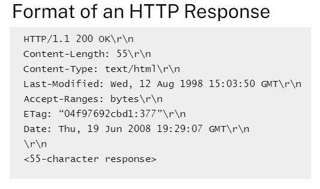

# ESP32 Web Server with Temperature and Humidity Monitoring

This project implements a web server on an ESP32 microcontroller that displays temperature and humidity data from a DHT11 sensor and allows control of two GPIO pins through a web interface.

## Features


- WiFi connectivity
- Web server implementation
- Temperature and humidity monitoring using DHT11 sensor
- Control of two GPIO pins (buzzer and relay) via web interface
- Responsive web design

## Hardware Requirements


- ESP32 development board
- DHT11 temperature and humidity sensor
- Buzzer
- Relay
- LEDs (optional, for visual indication)
- Appropriate power supply

## Software Dependencies

- Arduino IDE
- ESP32 board support for Arduino
- WiFi library (built-in with ESP32 board support)
- DHT sensor library

## Installation

1. Install the Arduino IDE and ESP32 board support.
2. Install the required DHT sensor library.
3. Clone this repository or download the source code.
4. Open the `.ino` file in Arduino IDE.
5. Update the WiFi credentials in the code:
   ```cpp
   const char* ssid = "your_SSID_here";
   const char* password = "your_PASSWORD_here";
   ```
6. Upload the code to your ESP32.

## Usage

1. Power on the ESP32.
2. The device will connect to the specified WiFi network.
3. Once connected, it will print its IP address to the Serial Monitor.
4. Open a web browser and navigate to the IP address.
5. The web interface will display temperature and humidity data, and buttons to control the GPIO pins.

## Web Server Communication

### HTTP Request Format


This image shows the typical format of an HTTP request. The ESP32 web server processes these requests to determine which actions to take.

### HTTP Response Format



This image illustrates the format of an HTTP response. The ESP32 sends responses in this format, including the HTML content for the web interface.

## System Architecture


This diagram shows the overall system architecture:
- The ESP32 acts as a web server (IP: 192.168.8.100), connected to a temperature/humidity sensor and LEDs.
- A client device (e.g., laptop, IP: 192.168.8.101) can access the web interface.
- Both devices connect through a router or access point (IP: 192.168.8.1).

## Contributing

Contributions to improve the project are welcome. Please feel free to submit a Pull Request.

## License

This project is open-source and available under the [MIT License](LICENSE).

